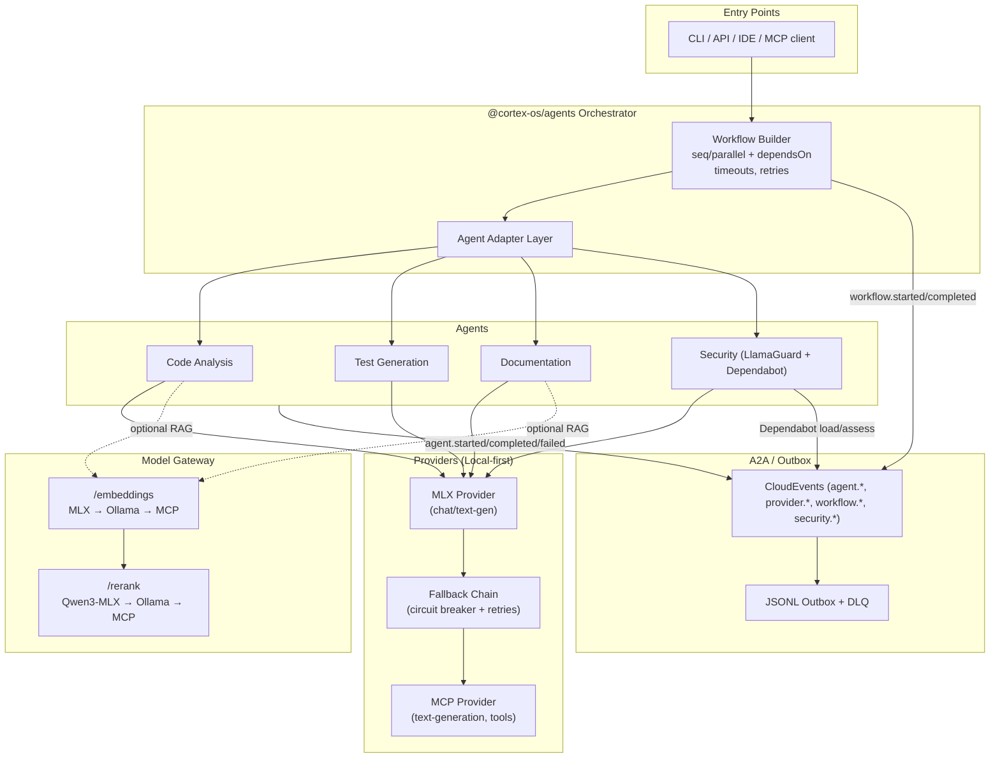
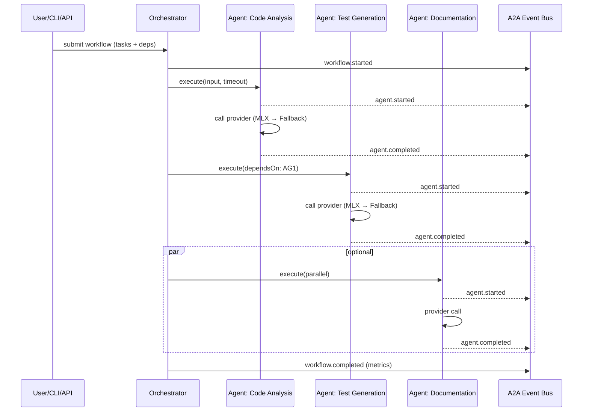
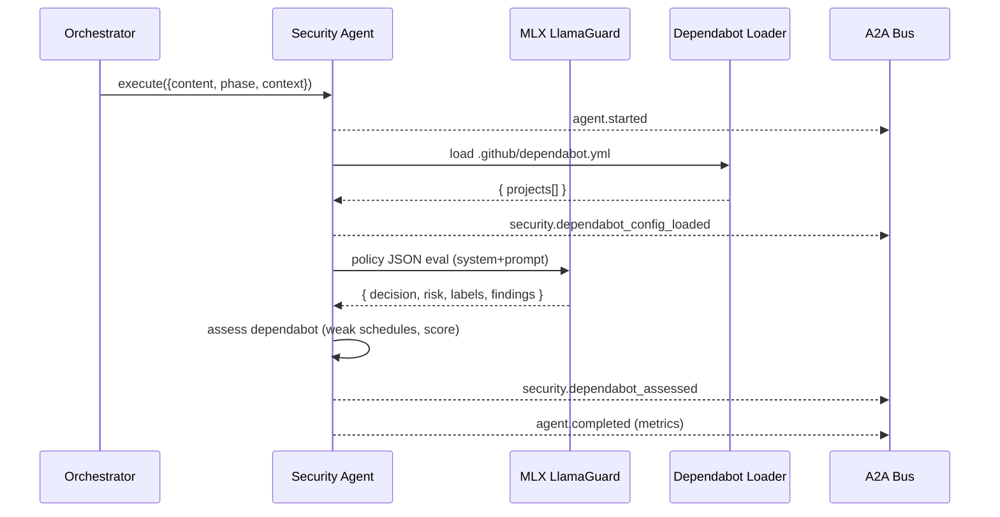
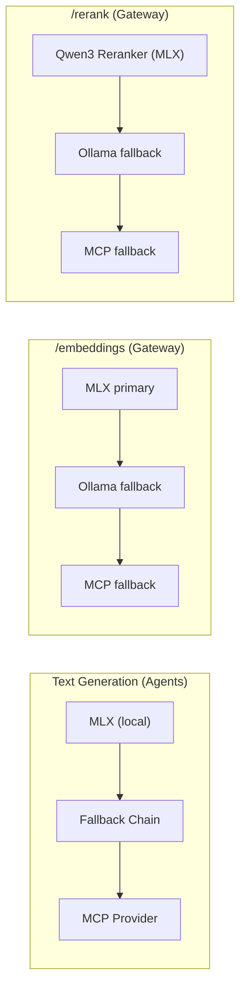

# Cortex‑OS Agents Framework

This document describes the architecture, runtime workflow, providers, and eventing model of the `@cortex-os/agents` package, including Security Guard integration, Model Gateway interactions (MLX → Ollama → MCP), and two‑stage retrieval for memories.

## High‑Level Architecture



## Workflow Execution (Sequential/Parallel)



## Security Guard (LlamaGuard + Dependabot)



## Memories: Two‑Stage Retrieval with Rerank

```mermaid
flowchart TD
  Q["Query text / vector"] -->|embed (if text)| EMB[/Model Gateway /embeddings/]
  subgraph Store["SQLite Store (memories)"]
    ANN["Initial Candidate Fetch (vector/recency)"]
    R1["TopN candidates"]
  end
  EMB --> ANN
  Q --> ANN
  ANN --> R1
  R1 -->|/rerank (Qwen3 MLX primary)| RER[/Model Gateway /rerank/]
  RER --> TOPK["TopK reranked"]
  TOPK --> OUT["Emit rerank.completed (JSONL Outbox / A2A)"]
```

## Provider Selection & Fallbacks



## Event Types (selected)

- workflow.started | workflow.completed | workflow.cancelled
- agent.started | agent.completed | agent.failed
- provider.success | provider.fallback
- security.dependabot_config_loaded | security.dependabot_assessed

Events are CloudEvents 1.0 compatible and published to the A2A bus and/or JSONL outbox for durability.

## CLI & Examples

- Security run (LlamaGuard): `pnpm -C packages/agents security:run`
- Audit workflow (code-analysis + security): `pnpm -C packages/agents security:audit`

## Configuration (quick)

- Model Gateway MCP fallback:
  - `MCP_TRANSPORT=stdio|sse|streamableHttp`
  - `MCP_COMMAND`/`MCP_ARGS` or `MCP_ENDPOINT`
- Memories:
  - `MODEL_GATEWAY_URL=http://localhost:8081`
  - `MEMORIES_RERANK_ENABLED=true`
  - `MEMORIES_OUTBOX_FILE=logs/memories-outbox.jsonl`

---

This architecture is local‑first (MLX), with graceful fallbacks to Ollama and MCP, and aligns with OWASP LLM‑10 and PRD governance (CloudEvents, provenance, deterministic tests).
