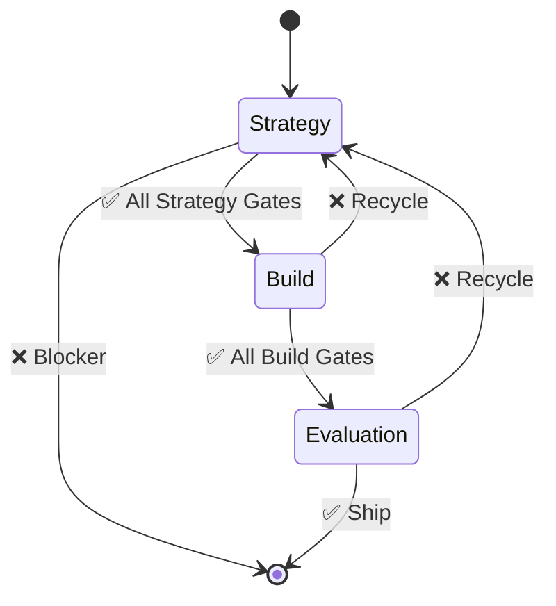

# Cortex-OS System Architecture and IDE

## Overview

Cortex-OS is a deterministic, local-first operating system designed to enable native multi-context processing (MCP) with integrated teaching capabilities. It focuses on providing seamless, reproducible computational environments that empower users to build, teach, and extend complex workflows interactively and collaboratively without relying on centralized cloud services.

## Why This Architecture Holds

- **Deterministic Execution**: Guarantees reproducible results by enforcing strict control over computational contexts and dependencies.
- **Local-First Design**: Prioritizes user data ownership and privacy by performing all critical operations on the client device.
- **MCP-Native**: Supports multiple concurrent processing contexts that can interact, synchronize, and evolve dynamically.
- **Teaching-Capable**: Embeds interactive teaching mechanisms that allow users to guide and extend system behavior through example-driven learning.
- **Extensible and Modular**: Designed for easy integration of new tools, workflows, and domain-specific extensions.
- **Robustness and Security**: Minimizes attack surface by avoiding unnecessary network dependencies and enforcing strict validation gates.

## System Structure

```markdown
┌───────────────────────────────────────────────────────────────┐
│ Cortex-OS IDE │
├───────────────────────────────────────────────────────────────┤
│ Core Kernel │
│ ├── Deterministic Scheduler │
│ ├── Local Storage Manager │
│ ├── MCP Context Manager │
│ └── Security & Validation Engine │
├───────────────────────────────────────────────────────────────┤
│ Interactive Teaching Layer │
│ ├── Example Capture & Replay │
│ ├── Behavior Extension Modules │
│ └── User Feedback Loop │
├───────────────────────────────────────────────────────────────┤
│ Tooling & Extensions │
│ ├── Language Runtimes │
│ ├── Workflow Orchestrators │
│ ├── Visualization & Debuggers │
│ └── Plugin System │
├───────────────────────────────────────────────────────────────┤
│ User Interface │
│ ├── Code Editor & Notebook │
│ ├── Context Navigator │
│ └── Real-time Collaboration │
└───────────────────────────────────────────────────────────────┘
```

## Implementation Roadmap

- **Phase 1: Core Kernel Development**
  - Build deterministic scheduler and MCP context manager.
  - Implement local storage manager with versioning and snapshot capabilities.
  - Develop security and validation engine for enforcing execution policies.

- **Phase 2: Interactive Teaching Layer**
  - Create example capture and replay mechanisms.
  - Design behavior extension modules that adapt based on user input.
  - Establish user feedback loops for continuous learning.

- **Phase 3: Tooling & Extensions**
  - Integrate language runtimes supporting multi-paradigm programming.
  - Develop workflow orchestrators for complex task automation.
  - Build visualization and debugging tools.
  - Construct a flexible plugin system for third-party extensions.

- **Phase 4: User Interface and Collaboration**
  - Design and implement code editor and notebook interfaces.
  - Develop context navigator for managing MCP contexts.
  - Enable real-time collaboration features with conflict resolution.

## PRP Phases & Validation Gates

Each PRP phase is an agentic pipeline step with explicit machine-checkable gates.

### Phase 1: Strategy & Design

- ✅ Blueprint linked in PRP doc
- ✅ Security baseline (OWASP ASVS L1 + MITRE ATLAS for AI/ML threat coverage)
- ✅ UX sketches accessible (WCAG 2.2 AA)
- ✅ Architecture diagram consistent with repo structure

### Phase 2: Build

- ✅ Backend passes compilation + tests
- ✅ API schema validated (OpenAPI/JSON Schema)
- ✅ Security scanner (CodeQL, Semgrep) ≤ agreed majors
- ✅ Frontend Lighthouse/Axe ≥ 90%
- ✅ Docs complete with API + usage notes

### Phase 3: Evaluation

- ✅ All neurons pass TDD (Red → Green)
- ✅ Reviewer neuron issues ≤ 0 blockers, ≤ 3 majors
- ✅ A11y, perf, sec budgets all ≥ thresholds
- ✅ Cerebrum consensus: ship or recycle

### Margins for Error

- **Blockers**: fail pipeline, cannot move forward
- **Majors**: allowed but logged; ≤3 per phase
- **Minors**: allowed; tracked as tech debt backlog

## PRP State Machine (LangGraph Sketch)



## Trends & Risk Mitigation

- **Latest Trends (Aug 2025)**  
  • Agent workflows shifting to LangGraph state machines with eval loops  
  • Policy-as-code (OPA, Zod, GitHub Actions) replacing ad hoc rules  
  • Standard CI gates: Lighthouse, CodeQL, Axe in PRs

- **Risk Mitigation**  
  • LangGraph API churn → pin at 0.6.6, wrap in CortexKernel  
  • Non-deterministic drift → enforce kernel policies (evidence_required, local_only)  
  • Complexity creep → forbid external orchestrators (CrewAI, AutoGen) in CI rules  
  • Determinism Enforcement: Use strict scheduling and state management to avoid nondeterministic behaviors.  
  • Data Integrity: Employ local-first storage with immutable snapshots to prevent data loss.  
  • Security Hardened Execution: Isolate MCP contexts and validate all extensions before execution.  
  • User-Centric Design: Incorporate extensive usability testing to ensure teaching mechanisms are intuitive.  
  • Extensibility Controls: Implement sandboxing and permission systems to manage third-party plugins safely.

## Deliverable

A fully functional Cortex-OS IDE that offers a deterministic, local-first environment with native multi-context processing and interactive teaching capabilities, enabling users to build, extend, and collaborate on complex computational workflows securely and reproducibly.
