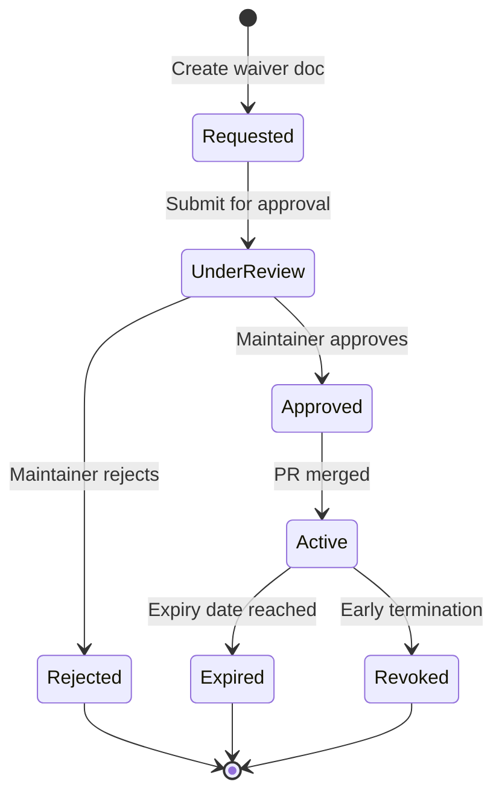

# AGENTS — Governance & Compliance Framework

> **For:** Maintainers, auditors, compliance officers
> **Authority:** Defines enforcement mechanisms and compliance mapping
> **Last Updated:** 2025-11-17

[](./LICENSE)

---

## Quick Navigation

- [CI Enforcement Matrix](#ci-enforcement-matrix) - Automated rule validation
- [Compliance Mapping](#compliance-mapping) - Standards alignment
- [Waiver Procedures](#waiver-procedures) - Exception handling
- [Audit Trail Requirements](#audit-trail-requirements) - Evidence tracking
- [Quality Metrics](#quality-metrics) - Coverage and mutation thresholds

**Related:**
[Contributor Guide](./CONTRIBUTING.md) | [AI Agent Rules](brainwav/governance/00-core/RULES_OF_AI.md) | [Root AGENTS](./AGENTS.md)

---

## CI Enforcement Matrix

### Overview

Every rule in the governance framework has corresponding CI automation. This matrix maps rules to jobs, scripts, and enforcement levels.

**Enforcement Levels:**
- 🔴 **BLOCKER** - Fails PR, blocks merge
- 🟡 **WARNING** - Surfaces in PR comments, requires ack
- 🟢 **ADVISORY** - Informational only

### Core Rules Enforcement

| Rule ID | Description | Enforcement | CI Job | Script/Check | Bypass |
|---------|-------------|-------------|--------|--------------|--------|
| **AGENTS-CHK-001** | Code review checklist token present | 🔴 BLOCKER | `agents-guard` | `grep "CODE-REVIEW-CHECKLIST:"` | Waiver only |
| **AGENTS-PRV-002** | Oversight logs attached | 🔴 BLOCKER | `agents-guard` | Search `brAInwav-vibe-check` in artifacts | Waiver only |
| **AGENTS-HMS-003** | Live model evidence present | 🔴 BLOCKER | `models-smoke` | Verify `MODELS:LIVE:OK` in logs | Waiver only |
| **AGENTS-ACL-004** | Package AGENTS.md not weakening root | 🔴 BLOCKER | `structure-validate` | Compare rule sets programmatically | N/A |
| **AGENTS-DOC-005** | Docs validation (no ERROR) | 🔴 BLOCKER | `docs-validate` | `scripts/gates/validate-docs.ts` | Waiver only |
| **AGENTS-TRC-006** | Trace context verification | 🔴 BLOCKER | `trace-verify` | `verify-trace-context.ts` | Waiver only |
| **AGENTS-MEM-007** | Local Memory parity (IDs present) | 🔴 BLOCKER | `memory-parity` | Check `json/memory-ids.json` + repo mirror | Waiver only |
| **AGENTS-A11Y-008** | WCAG reports attached (if UI touched) | 🔴 BLOCKER | `a11y-check` | jest-axe/axe JSON output | Skip if no UI |
| **AGENTS-LLM-009** | LLM Threat Controls mapping present | 🔴 BLOCKER | `llm-threats` | Grep `llm-controls-map.md` | Waiver only |
| **AGENTS-SKL-010** | Skills governance artifacts (if `skills/`) | 🔴 BLOCKER | `skills-guard` | Manifest/boundaries checks | Skip if no skills |
| **AGENTS-CHG-011** | Changeset present or skip-release label | 🔴 BLOCKER | `changeset-guard` | `pnpm check:changeset` | `skip-release` label |
| **AGENTS-NET-012** | Network sandbox (test isolation) | 🟡 WARNING | `test` | `ALLOW_TEST_NETWORK` override detection | `ALLOW_TEST_NETWORK=1` |
| **AGENTS-AST-013** | Asset size guard (<1 MiB default) | 🟡 WARNING | `pr-quality-gates` | `asset-size-guard.mjs` | `asset:allowed` label |
| **AGENTS-PRN-014** | Dead code baseline drift | 🟡 WARNING | `quality-gates` | `check-dead-code.mjs` (ts-prune) | Baseline update |
| **AGENTS-PYD-015** | Python dead code (vulture) | 🟡 WARNING | `python_quality` | `check-python-dead-code.mjs` | Allowlist entry |
| **AGENTS-MCP-016** | MCP server portability (no process.cwd) | 🔴 BLOCKER | `ci` | Unit test + ripgrep ban | N/A |
| **AGENTS-BUN-017** | Single-file bundle builds | 🔴 BLOCKER | `ci` | `pnpm bundle:single` success | N/A |

### Documentation Enforcement

Added: 2025-11-17 as part of documentation automation initiative

| Rule ID | Description | Enforcement | CI Job | Script/Check | Bypass |
|---------|-------------|-------------|--------|--------------|--------|
| **AGENTS-DOC-018** | Markdown linting (all .md files) | 🔴 BLOCKER | `lint-markdown` | `markdownlint-cli2` with `.markdownlint-cli2.yaml` | Waiver only |
| **AGENTS-DOC-019** | Governance doc structure validation | 🟡 WARNING | `lint-markdown` | `scripts/validate-governance-docs.mjs` | Fix or waiver |
| **AGENTS-DOC-020** | Package README template compliance | 🟡 WARNING | `lint-markdown` | `scripts/validate-package-readmes.mjs` | Fix or waiver |
| **AGENTS-DOC-021** | Code fence language specification | 🟡 WARNING | `lint-markdown` | Grep for bare triple backticks | Fix recommended |
| **AGENTS-DOC-022** | Bare URLs wrapped in angle brackets | 🟡 WARNING | `lint-markdown` | Grep for `http[s]://[^ )]*\s` | Fix recommended |
| **AGENTS-DOC-023** | Alt text on all images | 🔴 BLOCKER | `lint-markdown` | MD045 rule in markdownlint | N/A |
| **AGENTS-DOC-024** | Heading hierarchy (no skips) | 🟡 WARNING | `lint-markdown` | MD001 rule in markdownlint | Style override |
| **AGENTS-DOC-025** | Proper name capitalization | 🟡 WARNING | `lint-markdown` | MD044 rule (governance pack names, brAInwav, etc.) | Allowlist |

**Pre-commit Integration:**
- Markdown files run through `markdownlint-cli2 --fix` automatically
- Governance docs validated via `validate-governance-docs.mjs`
- Package READMEs validated via `validate-package-readmes.mjs`

**CI Workflow:**
- `.github/workflows/documentation.yml` job: `lint-markdown`
- Runs on all PRs touching `docs/**, packages/*/README.md, *.md` files
- Blocks merge if markdownlint ERRORS present
- Reports WARNINGS in PR comments

**Configuration:**
- Markdownlint rules: `.markdownlint-cli2.yaml`
- Template: `docs/README-TEMPLATE.md`
- Style guide reference: OpenAI Documentation Quality Guidelines

### Quality Gates Enforcement

| Metric | Threshold | Environment Override | CI Job | Enforcement |
|--------|-----------|---------------------|--------|-------------|
| **Branch Coverage** | ≥65% (PR gate) | `BRANCH_MIN` | `ci-quality-gate` | 🔴 BLOCKER |
| **Mutation Score** | ≥75% (PR gate) | `MUTATION_MIN` | `ci-mutation-guard` | 🔴 BLOCKER |
| **Statement Coverage** | ≥95% (aspirational) | `COVERAGE_THRESHOLD_STATEMENTS` | `test:coverage` | 🟡 WARNING |
| **Line Coverage** | ≥95% (aspirational) | `COVERAGE_THRESHOLD_LINES` | `test:coverage` | 🟡 WARNING |
| **Function Coverage** | ≥95% (aspirational) | `COVERAGE_THRESHOLD_FUNCTIONS` | `test:coverage` | 🟡 WARNING |
| **TDD Compliance** | ≥90% test-first ratio | N/A | `tdd-validate` | 🟡 WARNING |

### Security Enforcement

| Check | Tool | CI Job | Enforcement | Config |
|-------|------|--------|-------------|--------|
| **Secrets Scanning** | gitleaks | `security-modern` | 🔴 BLOCKER (ANY=block) | `.gitleaks.toml` |
| **SAST** | Semgrep | `security-modern` | 🔴 BLOCKER (ERROR=block) | `semgrep.yml` rules |
| **Dependency Audit** | npm audit / OSV | `supply-chain-security` | 🔴 BLOCKER (HIGH+) | `package.json` |
| **SBOM Generation** | CycloneDX | `supply-chain-security` | 🔴 BLOCKER (must exist) | Custom script |
| **License Compliance** | license-checker | `compliance` | 🟡 WARNING | Allowlist |
| **Container Scanning** | Trivy | `security-modern` | 🟡 WARNING | `.trivyignore` |

---

## Compliance Mapping

### Standards Alignment (Advisory)

The governance pack aligns with industry standards. This mapping is **informational** (not enforced by CI) but guides architecture decisions.

#### NIST SSDF (Secure Software Development Framework)

| NIST Practice | Cortex-OS Implementation | Evidence |
|---------------|-------------------------|----------|
| **PO.1.1** Identify stakeholders | `brainwav/governance/00-core/constitution.md` escalation tree | Constitutional doc |
| **PO.3.2** Train developers | Mandatory governance pack reading | `AGENTS.md` acknowledgment |
| **PS.1.1** Version control | Git with signed commits/tags | Commit signatures |
| **PS.2.1** Threat modeling | `llm-threat-controls.md` | Threat controls map |
| **PS.3.1** Dependency management | Lockfiles, SBOM, OSV scanning | `pnpm-lock.yaml` + SBOM |
| **PW.1.1** Secure coding | `CODESTYLE.md` + ESLint security rules | `.eslintrc.js` configs |
| **PW.4.1** Code review | Required PR reviews + checklist | `brainwav/governance/20-checklists/checklists.md` |
| **PW.7.1** Automated testing | 95% coverage + 90% mutation | CI test jobs |
| **PW.8.1** SAST | Semgrep OWASP profiles | `.github/workflows/security-modern.yml` |
| **RV.1.1** Vulnerability response | Dependabot + SECURITY.md | GitHub Security tab |

#### ISO/IEC 42001:2023 (AI Management System)

| Control | Cortex-OS Implementation | Evidence |
|---------|-------------------------|----------|
| **5.2** AI policy | `brainwav/governance/00-core/RULES_OF_AI.md` | Governance pack |
| **6.2.3** Risk assessment | `llm-threat-controls.md` | OWASP LLM Top 10 mapping |
| **7.2** Competence | Mandatory charter reading | AGENTS_MD_SHA logs |
| **7.5** Documented information | Task folder structure | `agentic-coding-workflow.md` §3 |
| **8.1** Operational planning | Phase machine (R→G→F→REVIEW) | `.cortex/run.yaml` |
| **8.3** AI system lifecycle | ArcTDD workflow | Charter enforcement |
| **9.1** Monitoring | OpenTelemetry + trace context | W3C traceparent logs |
| **9.2** Internal audit | Code review checklist | Reviewer evidence |
| **10.2** Continual improvement | Lessons learned docs | `tasks/<slug>/lessons-learned.md` |

#### OWASP LLM Top 10 (2025)

| Risk | Mitigation | Implementation | Evidence |
|------|-----------|----------------|----------|
| **LLM01** Prompt Injection | Input validation (Zod schemas) | All API boundaries | `UserInputSchema` patterns |
| **LLM02** Insecure Output Handling | Output sanitization + encoding | HTML escaping | Security scan rules |
| **LLM03** Training Data Poisoning | Academic license validation | Oversight gate | `license-validation.json` |
| **LLM04** Model Denial of Service | Rate limiting + timeouts | API gateway | Rate limiter configs |
| **LLM05** Supply Chain Vulnerabilities | SBOM + OSV scanning | CI security jobs | SBOM artifacts |
| **LLM06** Sensitive Information Disclosure | Secret redaction + logging controls | Structured logging | No secrets in logs |
| **LLM07** Insecure Plugin Design | MCP tool validation | Oversight gate | Vibe-check logs |
| **LLM08** Excessive Agency | Human-in-loop at REVIEW phase | Constitutional rule | Phase machine enforcement |
| **LLM09** Overreliance | Truthfulness standard | RULES_OF_AI.md | No false claims |
| **LLM10** Model Theft | Access controls + monitoring | OIDC/WIF auth | Identity gate |

#### EU AI Act Timeline

| Milestone | Date | Cortex-OS Status | Action Required |
|-----------|------|------------------|-----------------|
| **Act Entry into Force** | Aug 1, 2024 | ✅ Monitoring | Review quarterly |
| **Prohibited Practices Ban** | Feb 2, 2025 | ✅ Compliant | No social scoring/manipulation |
| **General Purpose AI Rules** | Aug 2, 2025 | 🟡 In Progress | GPAI transparency docs |
| **High-Risk System Compliance** | Aug 2, 2026 | 🟢 Ahead | Risk assessment complete |
| **Full Compliance Deadline** | Aug 2, 2027 | 🟢 On Track | Continue governance evolution |

**Classification:** Cortex-OS is a **General Purpose AI System** (provider of model orchestration), not a high-risk system unless deployed in specific contexts (medical, critical infrastructure).

**Transparency Requirements:**
- ✅ Technical documentation (this repo)
- ✅ Data governance (academic license validation)
- ✅ Risk management (OWASP LLM controls)
- ✅ Human oversight (REVIEW phase)

---

## Waiver Procedures

### When Waivers Are Needed

Waivers allow temporary bypass of governance rules under specific conditions.

**Valid Waiver Reasons:**
- Technical limitations (e.g., live model unavailable in test env)
- Time-bound exceptions (e.g., urgent security patch)
- Experimental features (clearly marked)
- Vendor/platform constraints

**Invalid Waiver Reasons:**
- "Too hard" or "takes too long"
- "Nobody will notice"
- "Just this once"
- Convenience

### Waiver Request Process

#### 1. Create Waiver Document

**Location:** `/.agentic-governance/waivers/<waiver_id>.md`

**Template:**
```markdown
---
waiver_id: WAIVER-2025-001
rule_id: AGENTS-HMS-003
status: requested
requested_by: @username
requested_at: 2025-11-17T10:00:00Z
approver: null
approved_at: null
expires_at: 2025-12-17T10:00:00Z
---

# Waiver Request: WAIVER-2025-001

## Rule Being Waived
AGENTS-HMS-003: Live model evidence requirement

## Reason
CI environment cannot access external LLM APIs due to network restrictions.

## Justification
- Security policy blocks outbound connections in CI
- Local models not available in GitHub Actions runners
- Tests validate contract adherence, not live model responses

## Mitigation
- Use mock responses only in CI
- Require live model evidence in staging/prod deployments
- Document limitation in deployment docs

## Duration
30 days (until network policy updated)

## Approval Workflow Link
[Apply Waiver Workflow Run](https://github.com/org/repo/actions/runs/12345)

## Reviewer Notes
_(Filled by approver)_
```

#### 2. Request Approval

**Workflow:** `.github/workflows/apply-waiver.yml`

**Required:**
- Maintainer or Constitution delegate approval
- Link to workflow run in waiver doc
- Expiry date (max 90 days)

#### 3. Activation Criteria

**A waiver is VALID only after:**
1. ✅ `charter-enforce / danger` posts approval in PR
2. ✅ Comment includes link to Apply Waiver workflow run
3. ✅ Workflow shows Maintainer approval
4. ✅ Waiver document updated with `status: approved`

### Waiver Lifecycle



### Waiver Audit

**Monthly Review (Maintainers):**
- Check `/.cortex/waivers/` for active waivers
- Expire outdated waivers
- Track waiver trends (if increasing, investigate root cause)

**Quarterly Report:**
- Waiver count by rule ID
- Average duration
- Approval rate
- Common patterns

---

## Audit Trail Requirements

### Task Evidence Package

Every task MUST produce an evidence package for audit purposes.

**Required Artifacts:**

#### 1. Run Manifest
**File:** `tasks/<slug>/json/run-manifest.json`

**Must Include:**
```json
{
  "task_id": "task-001",
  "tier": "feature|fix|refactor",
  "started_at": "2025-11-17T10:00:00Z",
  "completed_at": "2025-11-17T12:00:00Z",
  "arcs": [
    {
      "id": "arc-001",
      "steps": ["step1", "step2", "..."],
      "duration_min": 45,
      "evidence": {
        "test_red_green": "src/processor.test.ts:L42",
        "contract_snapshot": "json/contract-v1.json",
        "reviewer_pointer": "#pullrequest-comment-123"
      }
    }
  ],
  "governance": {
    "rules_index": "brainwav/governance/90-infra/governance-index.json",
    "AGENTS_MD_SHA": "abc123...",
    "llm_controls_map": "verification/llm-controls-map.md"
  },
  "evidence_pointers": [
    "logs/vibe-check/initial.json",
    "logs/academic-research/license-validation.json"
  ]
}
```

#### 2. Vibe Check Logs
**Files:**
- `tasks/<slug>/logs/vibe-check/initial.json` (pre-execution)
- `tasks/<slug>/logs/vibe-check/final.json` (post-execution)

**Required Fields:**
- `brand: "brAInwav"`
- `status: "pass"|"fail"`
- `trace_id: "<W3C-traceparent>"`
- `checks: { academic_research, license_validation, connector_health }`

#### 3. Academic Research
**Files:**
- `tasks/<slug>/logs/academic-research/findings.json` (raw results)
- `tasks/<slug>/logs/academic-research/license-validation.json` (license check)
- `tasks/<slug>/logs/academic-research/compliant-findings.json` (SAFE only)

#### 4. Memory IDs
**File:** `tasks/<slug>/json/memory-ids.json`

**Links decisions stored in Local Memory to file mirror.**

#### 5. SBOM & Attestations
**Files:**
- `tasks/<slug>/sbom/*.json` (CycloneDX 1.6+)
- `tasks/<slug>/attestations/*.bundle` (in-toto/SLSA, Sigstore signed)

#### 6. Trace Context
**File:** `tasks/<slug>/verification/trace-context.log`

**Proves W3C traceparent propagation.**

### PR Evidence Requirements

**Every PR must attach:**
1. ✅ Link to task folder (`tasks/<slug>/`)
2. ✅ Run manifest URL
3. ✅ Memory entry citations (`[mem_abc123]`)
4. ✅ Code review checklist (completed)
5. ✅ Changeset or `skip-release` label justification

**Reviewer Checklist:**
```markdown
## Evidence Review

- [ ] Run manifest exists and complete
- [ ] Vibe check logs show `brAInwav-vibe-check` token
- [ ] Academic research includes license validation
- [ ] Memory IDs present in manifest
- [ ] SBOM generated (if dependencies changed)
- [ ] Trace context verified
- [ ] LLM threat controls mapped
```

---

## Quality Metrics

### Coverage Tracking

**Branch Coverage History:**
```bash
# Record sample
pnpm coverage:branches:record

# View trend
pnpm coverage:branches:report

# Enforce minimum
BRANCH_MIN=65 pnpm coverage:branches:enforce
```

**Storage:** `reports/branch-coverage-history.json`

**PR Summary:**
- Lists failing/passing packages
- Shows threshold deltas
- Flags >5% regressions

### Mutation Testing

**Per-Package Reports:**
```bash
# Generate per-package mutation scores
pnpm mutation:packages

# View history with prior scores
pnpm nx run root:mutation-packages
```

**Enforcement:**
```bash
# Run mutation tests
pnpm mutation:test

# Enforce 90% minimum
pnpm mutation:enforce

# Or both
pnpm mutation:badges
```

**Output:**
- `reports/mutation/mutation.json` (Stryker output)
- `reports/mutation/per-package-summary.md` (metadata-aware)
- `reports/badges/mutation-score.svg` (visual)

### Quality Gate Composite

**Combined Check:**
```bash
pnpm quality:gate
```

**Passes if ALL:**
- Branch coverage ≥ `BRANCH_MIN` (default 65%)
- Mutation score ≥ `MUTATION_MIN` (default 75%)

**Exit Codes:**
- `0` - All pass
- `1` - Quality gate failed

---

## Governance Index Verification

### SHA-Pinned Rules

**Index Location:** `brainwav/governance/90-infra/governance-index.json`

**Structure:**
```json
{
  "version": "1.0.0",
  "generated_at": "2025-11-17T10:00:00Z",
  "documents": [
    {
      "path": "brainwav/governance/00-core/RULES_OF_AI.md",
      "sha256": "abc123...",
      "mandatory": true
    },
    {
      "path": "brainwav/governance/00-core/AGENT_CHARTER.md",
      "sha256": "f08875...",
      "mandatory": true
    }
  ]
}
```

### Agent Bootstrap Verification

**MUST (before any action):**
1. Load `brainwav/governance/90-infra/governance-index.json`
2. Compute SHA-256 of each listed document
3. Compare against index
4. **REFUSE to act if mismatch**

**Log Evidence:**
```
[brAInwav] Governance index verified | index_path=brainwav/governance/90-infra/governance-index.json | docs_count=15 | all_sha_match=true
```

### CI Verification

**Job:** `governance-index-verify`

**Script:** `.cortex/gates/verify-governance-index.ts`

**Enforcement:** 🔴 BLOCKER if any SHA mismatch

---

## Changelog

### Version 1.0.0 (2025-11-17)
- Initial governance framework documentation
- CI enforcement matrix with 17 rules
- Compliance mapping (NIST SSDF, ISO 42001, OWASP LLM, EU AI Act)
- Waiver procedures and lifecycle
- Audit trail requirements
- Quality metrics tracking

---

## Maintainer Contacts

**Governance Questions:**
- GitHub: @jamiescottcraik
- Email: governance@cortex-os.dev
- Issues: Label with `governance`

**Emergency Escalation:**
See `brainwav/governance/00-core/constitution.md` escalation tree

---

**Version:** 1.0.0
**Maintained by:** brAInwav Development Team
**License:** Apache-2.0

Built with ❤️ by the Cortex-OS Team
